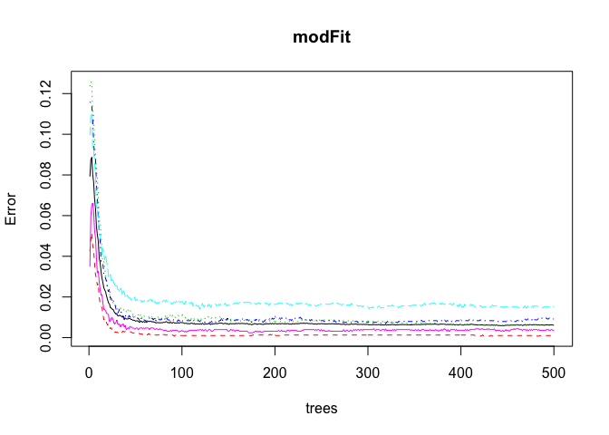
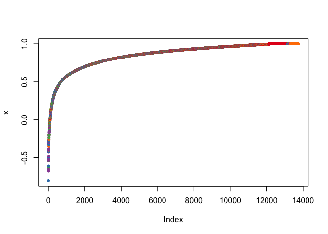

# Human Activity Recognition
Bart Lenoir  
22 November 2015  

### Synopsis

Using devices such as Jawbone Up, Nike FuelBand, and Fitbit it is now possible to collect a large amount of data about personal activity relatively inexpensively. These type of devices are part of the quantified self movement – a group of enthusiasts who take measurements about themselves regularly to improve their health, to find patterns in their behavior, or because they are tech geeks. One thing that people regularly do is quantify how much of a particular activity they do, but they rarely quantify how well they do it. In this project, the goal is to use data from accelerometers on the belt, forearm, arm, and dumbell of 6 participants. They were asked to perform barbell lifts correctly and incorrectly in 5 different ways. More information is available from the website here: http://groupware.les.inf.puc-rio.br/har (see the section on the Weight Lifting Exercise Dataset). 

### Libraries


```r
library(caret)
```

```
## Loading required package: lattice
## Loading required package: ggplot2
```

```r
library(randomForest)
```

```
## randomForest 4.6-12
## Type rfNews() to see new features/changes/bug fixes.
```

### Data Source

The training data for this project are available here: 

https://d396qusza40orc.cloudfront.net/predmachlearn/pml-training.csv

The test data are available here: 

https://d396qusza40orc.cloudfront.net/predmachlearn/pml-testing.csv

The data for this project come from this source: http://groupware.les.inf.puc-rio.br/har


```r
setwd("/Users/bartlenoir/gitrepo/HumanActivityRecognition")

# download.file("https://d396qusza40orc.cloudfront.net/predmachlearn/pml-training.csv", "pml-training.csv")
pmlTraining <- read.csv("pml-training.csv", na.strings=c("NA","#DIV/0!", ""))

# download.file("https://d396qusza40orc.cloudfront.net/predmachlearn/pml-testing.csv", "pml-testing.csv")
pmlTesting <- read.csv("pml-testing.csv", na.strings=c("NA","#DIV/0!", ""))
```

**View data.**


```r
dim(pmlTraining)
```

```
## [1] 19622   160
```

```r
str(pmlTraining, list.len=10)
```

```
## 'data.frame':	19622 obs. of  160 variables:
##  $ X                       : int  1 2 3 4 5 6 7 8 9 10 ...
##  $ user_name               : Factor w/ 6 levels "adelmo","carlitos",..: 2 2 2 2 2 2 2 2 2 2 ...
##  $ raw_timestamp_part_1    : int  1323084231 1323084231 1323084231 1323084232 1323084232 1323084232 1323084232 1323084232 1323084232 1323084232 ...
##  $ raw_timestamp_part_2    : int  788290 808298 820366 120339 196328 304277 368296 440390 484323 484434 ...
##  $ cvtd_timestamp          : Factor w/ 20 levels "02/12/2011 13:32",..: 9 9 9 9 9 9 9 9 9 9 ...
##  $ new_window              : Factor w/ 2 levels "no","yes": 1 1 1 1 1 1 1 1 1 1 ...
##  $ num_window              : int  11 11 11 12 12 12 12 12 12 12 ...
##  $ roll_belt               : num  1.41 1.41 1.42 1.48 1.48 1.45 1.42 1.42 1.43 1.45 ...
##  $ pitch_belt              : num  8.07 8.07 8.07 8.05 8.07 8.06 8.09 8.13 8.16 8.17 ...
##  $ yaw_belt                : num  -94.4 -94.4 -94.4 -94.4 -94.4 -94.4 -94.4 -94.4 -94.4 -94.4 ...
##   [list output truncated]
```

```r
# colnames(pmlTraining)
```


```r
dim(pmlTesting)
```

```
## [1]  20 160
```

```r
str(pmlTesting, list.len=10)
```

```
## 'data.frame':	20 obs. of  160 variables:
##  $ X                       : int  1 2 3 4 5 6 7 8 9 10 ...
##  $ user_name               : Factor w/ 6 levels "adelmo","carlitos",..: 6 5 5 1 4 5 5 5 2 3 ...
##  $ raw_timestamp_part_1    : int  1323095002 1322673067 1322673075 1322832789 1322489635 1322673149 1322673128 1322673076 1323084240 1322837822 ...
##  $ raw_timestamp_part_2    : int  868349 778725 342967 560311 814776 510661 766645 54671 916313 384285 ...
##  $ cvtd_timestamp          : Factor w/ 11 levels "02/12/2011 13:33",..: 5 10 10 1 6 11 11 10 3 2 ...
##  $ new_window              : Factor w/ 1 level "no": 1 1 1 1 1 1 1 1 1 1 ...
##  $ num_window              : int  74 431 439 194 235 504 485 440 323 664 ...
##  $ roll_belt               : num  123 1.02 0.87 125 1.35 -5.92 1.2 0.43 0.93 114 ...
##  $ pitch_belt              : num  27 4.87 1.82 -41.6 3.33 1.59 4.44 4.15 6.72 22.4 ...
##  $ yaw_belt                : num  -4.75 -88.9 -88.5 162 -88.6 -87.7 -87.3 -88.5 -93.7 -13.1 ...
##   [list output truncated]
```

```r
# colnames(pmlTesting)
```

### Data Processing

**Check for complete cases.**


```r
sum(complete.cases(pmlTraining))
```

```
## [1] 0
```

```r
sum(complete.cases(pmlTesting))
```

```
## [1] 0
```

**Remove incomplete columns.**


```r
# removing columns true zero variance
pmlTraining <- pmlTraining[, colSums(is.na(pmlTraining)) == 0]
pmlTesting <- pmlTesting[, colSums(is.na(pmlTesting)) == 0]
```

**Recheck for complete cases.**


```r
sum(complete.cases(pmlTraining))
```

```
## [1] 19622
```

```r
sum(complete.cases(pmlTesting))
```

```
## [1] 20
```

**Remove irrelevant columns.**


```r
pmlTraining <- pmlTraining[,-c(1:7)]
pmlTesting <- pmlTesting[,-c(1:7)]
```

**Review data.**


```r
# check variance
sum(nearZeroVar(pmlTraining, saveMetrics = TRUE)$zeroVar == T)
```

```
## [1] 0
```

```r
dim(pmlTraining)
```

```
## [1] 19622    53
```

```r
dim(pmlTesting)
```

```
## [1] 20 53
```

```r
head(pmlTraining, n = 2)
```

```
##   roll_belt pitch_belt yaw_belt total_accel_belt gyros_belt_x gyros_belt_y
## 1      1.41       8.07    -94.4                3         0.00            0
## 2      1.41       8.07    -94.4                3         0.02            0
##   gyros_belt_z accel_belt_x accel_belt_y accel_belt_z magnet_belt_x
## 1        -0.02          -21            4           22            -3
## 2        -0.02          -22            4           22            -7
##   magnet_belt_y magnet_belt_z roll_arm pitch_arm yaw_arm total_accel_arm
## 1           599          -313     -128      22.5    -161              34
## 2           608          -311     -128      22.5    -161              34
##   gyros_arm_x gyros_arm_y gyros_arm_z accel_arm_x accel_arm_y accel_arm_z
## 1        0.00        0.00       -0.02        -288         109        -123
## 2        0.02       -0.02       -0.02        -290         110        -125
##   magnet_arm_x magnet_arm_y magnet_arm_z roll_dumbbell pitch_dumbbell
## 1         -368          337          516      13.05217      -70.49400
## 2         -369          337          513      13.13074      -70.63751
##   yaw_dumbbell total_accel_dumbbell gyros_dumbbell_x gyros_dumbbell_y
## 1    -84.87394                   37                0            -0.02
## 2    -84.71065                   37                0            -0.02
##   gyros_dumbbell_z accel_dumbbell_x accel_dumbbell_y accel_dumbbell_z
## 1                0             -234               47             -271
## 2                0             -233               47             -269
##   magnet_dumbbell_x magnet_dumbbell_y magnet_dumbbell_z roll_forearm
## 1              -559               293               -65         28.4
## 2              -555               296               -64         28.3
##   pitch_forearm yaw_forearm total_accel_forearm gyros_forearm_x
## 1         -63.9        -153                  36            0.03
## 2         -63.9        -153                  36            0.02
##   gyros_forearm_y gyros_forearm_z accel_forearm_x accel_forearm_y
## 1               0           -0.02             192             203
## 2               0           -0.02             192             203
##   accel_forearm_z magnet_forearm_x magnet_forearm_y magnet_forearm_z
## 1            -215              -17              654              476
## 2            -216              -18              661              473
##   classe
## 1      A
## 2      A
```

```r
head(pmlTesting, n = 2)
```

```
##   roll_belt pitch_belt yaw_belt total_accel_belt gyros_belt_x gyros_belt_y
## 1    123.00      27.00    -4.75               20        -0.50        -0.02
## 2      1.02       4.87   -88.90                4        -0.06        -0.02
##   gyros_belt_z accel_belt_x accel_belt_y accel_belt_z magnet_belt_x
## 1        -0.46          -38           69         -179           -13
## 2        -0.07          -13           11           39            43
##   magnet_belt_y magnet_belt_z roll_arm pitch_arm yaw_arm total_accel_arm
## 1           581          -382     40.7     -27.8     178              10
## 2           636          -309      0.0       0.0       0              38
##   gyros_arm_x gyros_arm_y gyros_arm_z accel_arm_x accel_arm_y accel_arm_z
## 1       -1.65        0.48       -0.18          16          38          93
## 2       -1.17        0.85       -0.43        -290         215         -90
##   magnet_arm_x magnet_arm_y magnet_arm_z roll_dumbbell pitch_dumbbell
## 1         -326          385          481     -17.73748       24.96085
## 2         -325          447          434      54.47761      -53.69758
##   yaw_dumbbell total_accel_dumbbell gyros_dumbbell_x gyros_dumbbell_y
## 1     126.2360                    9             0.64             0.06
## 2     -75.5148                   31             0.34             0.05
##   gyros_dumbbell_z accel_dumbbell_x accel_dumbbell_y accel_dumbbell_z
## 1            -0.61               21              -15               81
## 2            -0.71             -153              155             -205
##   magnet_dumbbell_x magnet_dumbbell_y magnet_dumbbell_z roll_forearm
## 1               523              -528               -56          141
## 2              -502               388               -36          109
##   pitch_forearm yaw_forearm total_accel_forearm gyros_forearm_x
## 1          49.3         156                  33            0.74
## 2         -17.6         106                  39            1.12
##   gyros_forearm_y gyros_forearm_z accel_forearm_x accel_forearm_y
## 1           -3.34           -0.59            -110             267
## 2           -2.78           -0.18             212             297
##   accel_forearm_z magnet_forearm_x magnet_forearm_y magnet_forearm_z
## 1            -149             -714              419              617
## 2            -118             -237              791              873
##   problem_id
## 1          1
## 2          2
```

**Prepare for cross validation (random subsampling without replacement).**


```r
trainingDataSubSet <- createDataPartition(y=pmlTraining$classe, p=0.70, list=FALSE)
pmlTrainingSubSet <- pmlTraining[trainingDataSubSet, ] 
pmlTestingSubSet <- pmlTraining[-trainingDataSubSet, ]
```


```r
dim(pmlTrainingSubSet)
```

```
## [1] 13737    53
```

```r
dim(pmlTestingSubSet)
```

```
## [1] 5885   53
```

### Results

**Create model.**


```r
set.seed(123456789)

modFit <- randomForest(classe ~ ., data = pmlTrainingSubSet, method="class")

print(modFit)
```

```
## 
## Call:
##  randomForest(formula = classe ~ ., data = pmlTrainingSubSet,      method = "class") 
##                Type of random forest: classification
##                      Number of trees: 500
## No. of variables tried at each split: 7
## 
##         OOB estimate of  error rate: 0.62%
## Confusion matrix:
##      A    B    C    D    E class.error
## A 3902    3    0    0    1 0.001024066
## B    8 2642    8    0    0 0.006019564
## C    0   17 2374    5    0 0.009181970
## D    0    0   32 2218    2 0.015097691
## E    0    0    2    7 2516 0.003564356
```

```r
plot(modFit)
```

 

**Plot margin of observations (positive margin means correct classification).**


```r
plot(margin(modFit,pmlTrainingSubSet$classe))
```

 

**Run model on 'pmlTestingSubSet'.**


```r
# fine tuning model doesn't improve accuracy
# tuneRF(subset(pmlTrainingSubSet, select = -c(classe)), pmlTrainingSubSet$classe, doBest = TRUE)
# varImpPlot(modFit, pch = 19)

pmlPred <- predict(modFit, newdata = pmlTestingSubSet, type = "class")
```

**Expected out-of-sample error:**


```r
confusionMatrix(pmlPred, pmlTestingSubSet$classe)
```

```
## Confusion Matrix and Statistics
## 
##           Reference
## Prediction    A    B    C    D    E
##          A 1674    5    0    0    0
##          B    0 1133    3    0    0
##          C    0    1 1023    7    0
##          D    0    0    0  957    1
##          E    0    0    0    0 1081
## 
## Overall Statistics
##                                           
##                Accuracy : 0.9971          
##                  95% CI : (0.9954, 0.9983)
##     No Information Rate : 0.2845          
##     P-Value [Acc > NIR] : < 2.2e-16       
##                                           
##                   Kappa : 0.9963          
##  Mcnemar's Test P-Value : NA              
## 
## Statistics by Class:
## 
##                      Class: A Class: B Class: C Class: D Class: E
## Sensitivity            1.0000   0.9947   0.9971   0.9927   0.9991
## Specificity            0.9988   0.9994   0.9984   0.9998   1.0000
## Pos Pred Value         0.9970   0.9974   0.9922   0.9990   1.0000
## Neg Pred Value         1.0000   0.9987   0.9994   0.9986   0.9998
## Prevalence             0.2845   0.1935   0.1743   0.1638   0.1839
## Detection Rate         0.2845   0.1925   0.1738   0.1626   0.1837
## Detection Prevalence   0.2853   0.1930   0.1752   0.1628   0.1837
## Balanced Accuracy      0.9994   0.9971   0.9977   0.9963   0.9995
```

**Run model on final 'pmlTesting'.**


```r
pmlPredFinal <- predict(modFit, newdata = pmlTesting, type="class")
pmlPredFinal
```

```
##  1  2  3  4  5  6  7  8  9 10 11 12 13 14 15 16 17 18 19 20 
##  B  A  B  A  A  E  D  B  A  A  B  C  B  A  E  E  A  B  B  B 
## Levels: A B C D E
```


```r
pml_write_files = function(x){
  n = length(x)
  for(i in 1:n){
    filename = paste0("problem_id_",i,".txt")
    write.table(x[i],file=filename,quote=FALSE,row.names=FALSE,col.names=FALSE)
  }
}

pml_write_files(pmlPredFinal)
```
